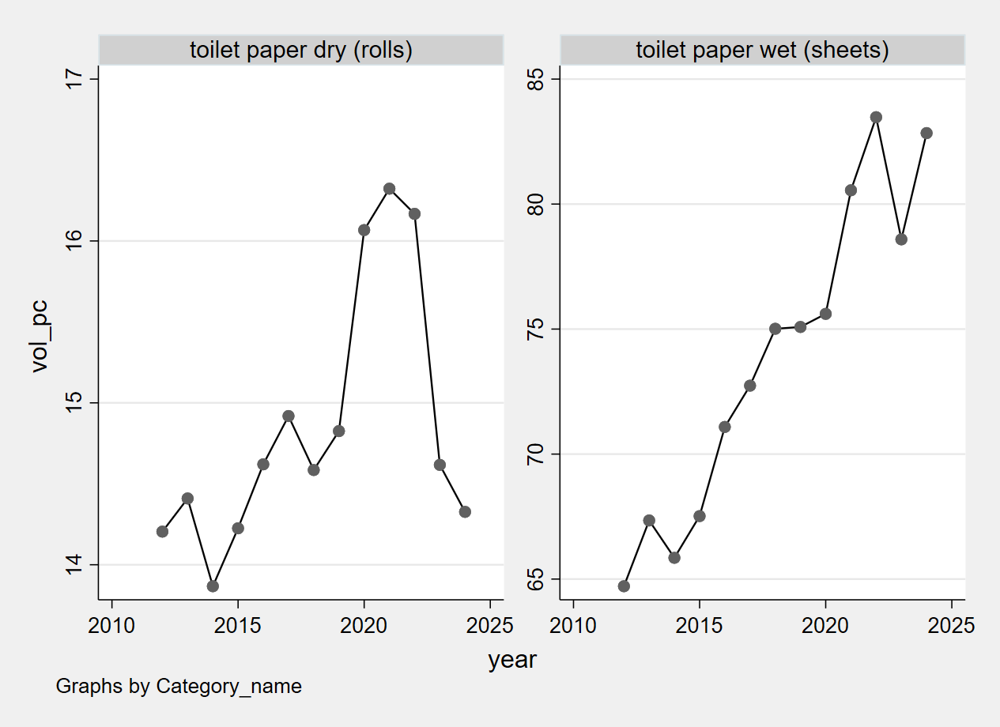

# panelDataDiagnostics
This repository checks country level panel data for trends in purchases, barcodes, and panelists. 

The graph below lists scanning activity (expressed per hh member) on a category, toilet-tissue, where we expected low consumption trends. The idea is that this would perhaps function as a test of trends in scanning activity or diligence. The attached graph shows however large shocks in the covid years. Putatively, these are because of social distancing and stay-at-home measures. There appears to be little evidence of a long term downward trend, as one might worry about decreasing diligence in scanning activity. 

